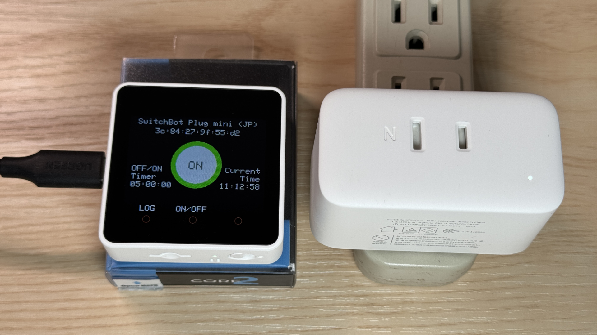

m5stack-switchbot-plug-timer
===============

m5stack-switchbot-plug-timer は、BLE で SwitchBot プラグミニ（JP）の電源を ON/OFF する M5Stack Core2 向け Arduino コードです。時刻をセットすることで、自動的に SwitchBot プラグミニ（JP）の電源を OFF/ON することもできます。

[](imgs/top.jpg)

## モチベーション

我が家のホームルーターは数日に一度くらいの頻度で、有線接続の PC がネットワークから切断されるという現象に悩まされていました。頻度は多くないものの Wi-Fi も時々不調に陥りました。

頻繁にルーターの電源の OFF/ON という不毛な作業を繰り返すという無駄な作業から解放されたいと思い、SwitchBot プラグミニ（JP）と M5Stack Core2を使って毎日指定の時刻に自動的にルーターを OFF/ON する仕組みを作ってみました。

## 動作環境

必要なハードウェアは次の通りです：

- [SwitchBot プラグミニ（JP）](https://www.switchbot.jp/products/switchbot-plug-mini)
    - 「[SwitchBot プラグミニ（JP） HomeKit対応](https://www.switchbot.jp/products/switchbot-plugmini-homekit) 」という類似商品が販売されていますが、動作は確認していません。
- [M5Stack Core2 IoT開発キット](https://www.switch-science.com/products/6530)
    - 「[M5Stack Core2 v1.1](https://www.switch-science.com/products/9349)」という新バージョンの製品が販売されていますが、動作は確認していません。

必要なソフトウェア環境は次の通りです：

- [Arduino IDE](https://www.arduino.cc/en/software)
    - ソースコードをコンパイルして M5Stack Core2 にアップロードできる環境を用意してください。開発環境の手順は M5Stack の[公式ドキュメント](https://docs.m5stack.com/en/arduino/m5core2/program)をご覧ください。

## ご利用の注意

電気用品安全法により、スマートプラグを使って特定の電気用品を接続して遠隔操作することが禁じられています。火災や感電などの事故につながる可能性があるため、SwitchBot プラグミニ（JP）に接続する電気用品には注意してください。

m5stack-switchbot-plug-timer は、SwitchBot プラグミニ（JP）にホームルーターを接続することを想定していますが、それに伴いルーターに異常が発生したとしても一切の責任を負いません。自己責任においてご利用ください。

**m5stack-switchbot-plug-timer を試す前に必ず[免責事項](#免責事項)および[ライセンス](#ライセンス)をご確認ください。** 同意いただけた方のみご利用ください。

## 準備

ソースコード `m5stack-switchbot-plug-timer.ino` の 21 行目あたりからユーザー設定のコードがありますので、ご利用の環境に合わせて設定してください。以下の設定例は、毎日 3 時に Wi-Fi に接続して NTP 時刻同期を行います。そして、毎日 5 時に SwitchBot Plug Mini を OFF/ON します。OFF してから 5 秒待って ON します。

```cpp
// ================================================================
// ユーザー設定
// ----------------------------------------------------------------

// SwitchBot Plug Mini の BLE MAC アドレス
char* BLE_MAC_ADDR = "3c:84:27:ff:ff:ff";

// Wi-FI の SSID とパスワード
char* SSID = "YOUR_SSID";
char* PASS = "YOUR_PASSWORD";

// OFF/ON を実施したい時刻 ("hh:mm:ss")
// - OFF/ON を実施しない場合は空文字列をセット
char* TIMER_TIME = "05:00:00";

// OFF から ON までの待ち時間 (ミリ秒)
uint16_t TIMER_INTERVAL = 5000;

// NTP で時刻同期する時刻 ("hh:mm:ss")
char* NTP_TIME = "03:00:00";
```

SwitchBot Plug Mini の BLE MAC アドレスは、Switchbot 公式スマホアプリから確認することができます。次のように、プラグミニの詳細画面を開き、画面右上の設定アイコンをタップして設定画面を開きます。設定画面の「デバイス情報」をタップすると、BLE MAC アドレスを確認することができます。

[](imgs/macaddr1.png)
[](imgs/macaddr2.png)
[](imgs/macaddr3.png)

## リリースノート

* v1.0.0 (2025-01-22)
  * 初版リリース

## リファレンス

* SwitchBot プラグミニ（JP）
    * [本家販売ページ](https://www.switchbot.jp/products/switchbot-plug-mini)
    * BLE 仕様 
        * [SwitchBotAPI-BLE](https://github.com/OpenWonderLabs/SwitchBotAPI-BLE/tree/latest)
        * [SwitchBot Plug Mini BLE open API](https://github.com/OpenWonderLabs/SwitchBotAPI-BLE/blob/latest/devicetypes/plugmini.md)
* M5Stack Core2
    * [スイッチサイエンス販売ページ](https://www.switch-science.com/products/6530)
    * [M5Stack 本家販売ページ](https://shop.m5stack.com/products/m5stack-core2-esp32-iot-development-kit)
    * [M5Stack 本家説明ページ](https://docs.m5stack.com/en/core/core2)
    * [Arduino 開発ガイド](https://docs.m5stack.com/en/arduino/arduino_ide)
    * API リファレンス
        * [Buttons](https://docs.m5stack.com/en/arduino/m5core2/button)
        * [LCD Screen](https://docs.m5stack.com/en/arduino/m5core2/lcd_api)
        * [RTC](https://docs.m5stack.com/en/arduino/m5core2/rtc_api)

## 免責事項

本ソフトウェア（以下、「本ソフトウェア」といいます）は、現状のまま提供され、いかなる保証も伴いません。開発者または著作権者（以下、「提供者」といいます）は、明示または黙示を問わず、本ソフトウェアに関するいかなる保証（特定目的適合性、商品性、非侵害性、正確性などを含むがこれに限らない）をいたしません。

提供者は、本ソフトウェアの使用または使用不能により生じるいかなる直接的、間接的、特別、付随的、結果的損害（データの損失、業務の中断、利益の損失などを含むがこれに限らない）について、一切の責任を負いません。たとえ提供者がそのような損害の可能性について知らされていた場合でも同様です。

本ソフトウェアの使用は、すべて利用者自身の責任において行われるものとし、本ソフトウェアの導入、利用、またはその結果については、利用者がすべての責任を負うものとします。

本免責事項は、予告なく変更されることがあります。

## ライセンス

本ソースコードは MIT ライセンスのもとに公開されます。詳細は [LICENSE](LICENSE) ファイルをご覧ください。

